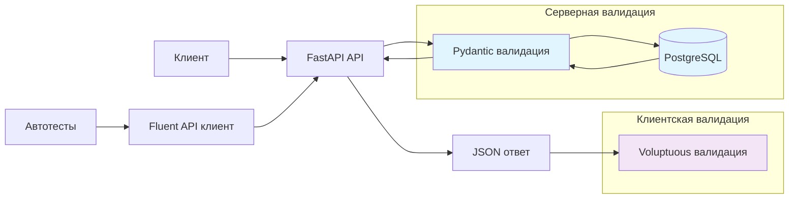

<div align="center">

[](https://Badx86.github.io/python_advanced/)
[](https://www.python.org/)
[](https://pydantic.dev/)
[](https://pypi.org/project/voluptuous/)
[](https://fastapi.tiangolo.com/)
[](https://www.uvicorn.org/)
[](https://www.postgresql.org/)
[](https://sqlmodel.tiangolo.com/)
[](https://docs.pytest.org/)
[](https://docs.python-requests.org/)
[](https://pypi.org/project/pytest-sugar/)
[](https://python-poetry.org/)
[](https://www.docker.com/)
[](https://mimesis.name/)
[](https://pypi.org/project/curlify/)
[](https://github.com/psf/black)

</div>

# FastAPI Reqres with PostgreSQL + Schema Validation

Микросервис на FastAPI с автотестами, интеграцией PostgreSQL и двойной валидацией схем API.

## 🏗️ Архитектура валидации данных



| Тип            | Библиотека | Назначение                               | Пример                                       |
|----------------|------------|------------------------------------------|----------------------------------------------|
| **Серверная**  | Pydantic   | Валидирует входящие/исходящие данные API | `class UserCreate(SQLModel): name: str`      |
| **Клиентская** | Voluptuous | Проверяет структуру ответов в тестах     | `USER_CREATED = S({"id": str, "name": str})` |

## 🚀 Fluent API для тестов

**Было (verbose):**

```python
response = requests.post("/api/users", json={"name": "John", "job": "Dev"})
assert response.status_code == 201
data = response.json()
assert "id" in data
assert "name" in data
# + еще 'N' строк проверок...
```

**Стало (fluent):**

```python
user_id = test_data.create_user("John", "Dev")
```

## Основные возможности

- **PostgreSQL интеграция** - пользователи хранятся в базе данных
- **Docker Compose** - полная инфраструктура (API + PostgreSQL + Adminer)
- **Автоматическая миграция** - создание таблиц и загрузка данных при старте
- **Расширенный healthcheck** - подробная информация о состоянии системы
- **CRUD тесты с реальной БД** - изолированное тестирование операций
- **SQLModel ORM** - современный подход к работе с базой данных
- **Пагинация** - эффективная обработка больших наборов данных
- **Подробное логирование** - логи всех операций
- **cURL Integration** - автоматическая генерация curl команд для отладки ошибок
- **Allure отчеты** - детальная отчетность с автодеплоем
- **Schema Validation** - автоматическая валидация API ответов
- **Fluent API** - тесты с method chaining
- **Environment Management** - тесты на local/staging/prod

## Установка и запуск

### 🐳 1. Через Docker (рекомендуется)

```bash
# Клонировать репозиторий
git clone <repo-url>
cd python_advanced

# Запустить всю инфраструктуру
docker-compose up --build

# Сервер будет доступен на:
# - API: http://localhost:8000
# - PostgreSQL: localhost:5432
# - Adminer (веб-интерфейс БД): http://localhost:8080
```

**Что включено в Docker Compose:**

- **FastAPI app** - основное приложение на порту 8000
- **PostgreSQL 15** - база данных на порту 5432
- **Adminer** - веб-интерфейс для управления БД на порту 8080

### 🔧 2. Локальная разработка

```bash
# Установка Poetry (если еще не установлен)
curl -sSL https://install.python-poetry.org | python3 -

# Установка зависимостей проекта
poetry install

# Настройка переменных окружения
cp .env.example .env
# Отредактируйте .env файл
```

## Настройка окружения

Создайте `.env` файл в корне проекта:

| Переменная         | Описание                              | Значение по умолчанию | Обязательно |
|--------------------|---------------------------------------|-----------------------|-------------|
| POSTGRES_USER      | Пользователь PostgreSQL               | postgres              | Да          |
| POSTGRES_PASSWORD  | Пароль PostgreSQL                     | example               | Да          |
| POSTGRES_HOST      | Хост PostgreSQL                       | localhost             | Да          |
| POSTGRES_PORT      | Порт PostgreSQL                       | 5432                  | Да          |
| POSTGRES_DB        | База данных PostgreSQL                | postgres              | Да          |
| DATABASE_ENGINE    | Строка подключения (автогенерируется) | -                     | Да          |
| DATABASE_POOL_SIZE | Размер пула соединений                | 10                    | Нет         |
| HOST               | IP адрес для запуска сервера          | 0.0.0.0               | Нет         |
| PORT               | Порт для запуска сервера              | 8000                  | Нет         |
| API_URL            | Базовый URL для тестов                | http://localhost:8000 | Да          |
| APP_VERSION        | Версия приложения                     | 1.0.0                 | Нет         |
| LOG_LEVEL          | Уровень логирования                   | DEBUG                 | Нет         |
| SHOW_DB_LOGS       | Показывать SQL логи                   | true                  | Нет         |

Пример `.env`:

```bash
# DB
POSTGRES_USER=postgres
POSTGRES_PASSWORD=example
POSTGRES_HOST=localhost
POSTGRES_PORT=5432
POSTGRES_DB=postgres

# DATABASE_ENGINE
DATABASE_ENGINE=postgresql+psycopg2://${POSTGRES_USER}:${POSTGRES_PASSWORD}@${POSTGRES_HOST}:${POSTGRES_PORT}/${POSTGRES_DB}

# Other settings
DATABASE_POOL_SIZE=10
HOST=0.0.0.0
PORT=8000
API_URL=http://localhost:8000
APP_VERSION=1.0.0
LOG_LEVEL=DEBUG
SHOW_DB_LOGS=true
```

### 🚀 3. Запуск локально

```bash
# Запустить PostgreSQL (через Docker)
docker-compose up db -d

# Запустить приложение
poetry run python app/main.py

# Сервер: http://localhost:8000
```

### 4. Запуск тестов

```bash
# Все тесты с Allure отчетом (убедитесь что сервер запущен)
poetry run pytest tests/ -v --alluredir=allure-results

# Тесты с валидацией схем
pytest tests/test_api_schemas.py -v

# Разные окружения
pytest tests/ --env=local      # http://localhost:8000
pytest tests/ --env=staging    # https://staging-api.com
pytest tests/ --env=prod       # https://api.com

# По маркерам
poetry run pytest -m smoke --alluredir=allure-results      # Smoke тесты
poetry run pytest -m auth --alluredir=allure-results       # Аутентификация  
poetry run pytest -m crud --alluredir=allure-results       # CRUD операции
poetry run pytest -m pagination --alluredir=allure-results # Пагинация
poetry run pytest -m "not slow" --alluredir=allure-results # Исключить медленные (delay)
pytest -m schema                                           # Валидация схем

# Конкретный файл
poetry run pytest tests/test_auth.py -v --alluredir=allure-results

# Генерация Allure отчета
poetry run allure serve allure-results

# Статический Allure отчет
poetry run allure generate allure-results --output allure-report --clean
```

## 🗄️ База данных

### Подключение к PostgreSQL

**Через Docker (Adminer):**

- URL: http://localhost:8080
- Система: PostgreSQL
- Сервер: db
- Пользователь: postgres
- Пароль: example
- База данных: postgres

**Через CLI:**

```bash
# Подключение к контейнеру PostgreSQL
docker exec -it fastapi_postgres psql -U postgres -d postgres

# Или через локальный клиент
psql -h localhost -U postgres -d postgres
```

### Данные

При первом запуске приложение автоматически:

1. Создает таблицы в PostgreSQL (User, Resource)
2. Загружает 12 тестовых пользователей из `app/data/users.json` в БД
3. Загружает 12 тестовых ресурсов из `app/data/resources.json` в БД

## API

Сервер автоматически генерирует интерактивную документацию:

- **Swagger UI:** http://localhost:8000/docs
- **ReDoc:** http://localhost:8000/redoc

### Основные эндпоинты:

**Система:**

- `GET /status` - Подробный статус приложения с информацией о БД

**Пользователи:**

- `GET /api/users` - Список пользователей (с пагинацией и delay)
- `GET /api/users/{id}` - Получить пользователя по ID
- `POST /api/users` - Создать пользователя (сохраняется в БД)
- `PUT /api/users/{id}` - Полное обновление пользователя
- `PATCH /api/users/{id}` - Частичное обновление пользователя
- `DELETE /api/users/{id}` - Удалить пользователя (из БД)

**Аутентификация:**

- `POST /api/register` - Регистрация (с валидацией email)
- `POST /api/login` - Вход в систему

**Ресурсы:**

- `GET /api/resources` - Список ресурсов (из JSON файла)
- `GET /api/resources/{id}` - Получить ресурс по ID
- `POST /api/resources` - Создать ресурс (сохраняется в БД)
- `PUT /api/resources/{id}` - Полное обновление ресурса
- `PATCH /api/resources/{id}` - Частичное обновление ресурса
- `DELETE /api/resources/{id}` - Удалить ресурс (из БД)

## Структура проекта

```
├── app/
│   ├── data/
│   │   ├── users.json           # Тестовые данные пользователей (seed)
│   │   └── resources.json       # Тестовые данные ресурсов
│   ├── database/
│   │   ├── engine.py            # Настройка SQLModel и PostgreSQL
│   │   └── seed.py              # Загрузка seed данных в БД
│   ├── routes/
│   │   ├── __init__.py
│   │   ├── auth.py              # Эндпоинты аутентификации
│   │   ├── resources.py         # Эндпоинты ресурсов (прямая работа с БД)
│   │   ├── system.py            # Системные эндпоинты (healthcheck)
│   │   └── users.py             # Эндпоинты пользователей (прямая работа с БД)
│   ├── main.py                  # FastAPI приложение и настройка
│   ├── exceptions.py            # Унифицированные исключения
│   └── models.py                # SQLModel модели для БД и API
├── tests/
|   ├── schemas.py               # Схемы валидации API (Voluptuous)
|   ├── api_client.py            # Fluent API клиент
|   ├── test_api_schemas.py      # Тесты с валидацией схем
│   ├── test_auth.py             # Тесты аутентификации (email валидация)
│   ├── test_crud_users.py       # CRUD операции с users
│   ├── test_crud_resources.py   # CRUD операции с resources
│   ├── test_resources.py        # Тесты ресурсов
│   ├── test_smoke.py            # Smoke тесты
│   ├── test_special.py          # Специальные тесты (delayed response)
│   ├── test_users.py            # Тесты пользователей
│   ├── test_pagination.py       # Тесты пагинации
│   ├── test_validation.py       # Валидация
│   ├── conftest.py              # Поддержка различных окружений, Pytest фикстуры и Allure конфигурация
│   └── assertions.py            # Хелперы для проверок с Allure отчетностью
├── allure-results/              # Результаты тестов для Allure (генерируется)
├── allure-report/               # Статический Allure отчет (генерируется)
├── docker-compose.yml           # Docker инфраструктура с переменными окружения
├── Dockerfile                   # Образ FastAPI приложения
├── .dockerignore                # Docker ignore файл
├── pyproject.toml               # Poetry конфигурация и зависимости
├── poetry.lock                  # Закрепленные версии зависимостей
├── .env                         # Переменные окружения (PostgreSQL + настройки)
├── .gitignore                   # Git ignore файл
├── api.log                      # Логи API (генерируется автоматически)
└── README.md                    # Документация проекта
```

## Тесты

**Всего: 102 теста (включая тесты с параметризацией)** разбитых по функциональным областям.

### Покрытие:

- **Smoke** - доступность сервиса, статус приложения
- **Authentication** - регистрация/логин с email валидацией
- **CRUD operations** - создание/обновление/удаление пользователей и ресурсов в БД
- **Users** - получение, пагинация, уникальность ID
- **Resources** - получение, пагинация ресурсов (из JSON)
- **Special** - delayed response с измерением времени
- **Pagination** - проверка расчетов pages/items, различных данных на страницах, невалидные параметры
- **Schema Validation** - проверка структуры API ответов
- **Business Rules** - консистентность данных

### Особенности тестирования:

- **Изоляция тестов** - каждый тест работает независимо
- **Реальная БД** - CRUD тесты создают/удаляют записи в PostgreSQL
- **Автоматическая проверка** доступности сервиса перед запуском
- **Параметризованные тесты** для покрытия различных сценариев
- **Подробные логи** всех операций для отладки
- **Allure отчеты** - детальная отчетность с категоризацией и вложениями
- **cURL команды** - автоматическое логирование для отладки ошибок

## 📊 Allure отчеты

Проект интегрирован с **Allure Framework** для генерации подробных тест-отчетов:

- **Отчет**: [https://Badx86.github.io/python_advanced/](https://Badx86.github.io/python_advanced/)

### Работа с Allure локально:

```bash
# Установка Allure (macOS)
brew install allure

# Установка Allure (Windows)
scoop install allure

# Запуск тестов с генерацией данных для Allure
poetry run pytest tests/ --alluredir=allure-results

# Открытие интерактивного отчета
poetry run allure serve allure-results

# Генерация статического отчета
poetry run allure generate allure-results --output allure-report --clean
```

## 🔧 Разработка

### Полезные команды:

```bash
# Перезапуск только приложения (без БД)
docker-compose up app --build

# Просмотр логов
docker-compose logs app
docker-compose logs db

# Остановка всех сервисов
docker-compose down

# Очистка данных БД
docker-compose down -v

# Форматирование кода
poetry run black app/ tests/

# Линтинг
poetry run pylint app/

# Тесты с Fluent API
poetry run pytest tests/test_api_schemas.py --env=local

# Просмотр зависимостей
poetry show --tree

# Allure отчеты
poetry run pytest tests/ --alluredir=allure-results
poetry run allure serve allure-results
```

### Мониторинг:

```bash
# Проверка статуса приложения
curl http://localhost:8000/status

# Проверка здоровья PostgreSQL
docker-compose exec db pg_isready -U postgres

# Просмотр статистики Docker
docker stats
```

## Особенности

- **Модульная архитектура** - роуты разделены по функциональным областям
- **SQLModel интеграция** - современный ORM от создателя FastAPI
- **Connection pooling** - эффективное управление соединениями с БД
- **Автоматические миграции** - создание таблиц при старте приложения
- **Автозагрузка данных** - seed данные загружаются при первом запуске
- **Email валидация** с использованием `email-validator`
- **Delayed response** для тестирования с задержкой
- **Health check** с проверкой состояния БД
- **Унифицированная обработка ошибок** - консистентные API исключения
- **Типизация** - полная поддержка type hints
- **Docker** - контейнеризация
- **Adminer интеграция** - веб-интерфейс для управления БД
- **Allure отчеты** - детальная отчетность с автодеплоем

## 🐛 Отладка

### Распространенные проблемы:

**База данных недоступна:**

```bash
# Проверить статус контейнеров
docker-compose ps

# Перезапустить БД
docker-compose restart db

# Проверить логи БД
docker-compose logs db
```

**Ошибки в тестах:**

```bash
# Убедиться что сервер запущен
curl http://localhost:8000/status

# Проверить переменные окружения
cat .env

# Запустить конкретный тест с подробными логами
poetry run pytest tests/test_smoke.py::TestSmoke::test_service_is_alive -v -s
```

**Проблемы с зависимостями:**

```bash
# Переустановить зависимости
poetry install --no-cache

# Обновить lock файл
poetry lock --no-update
```
